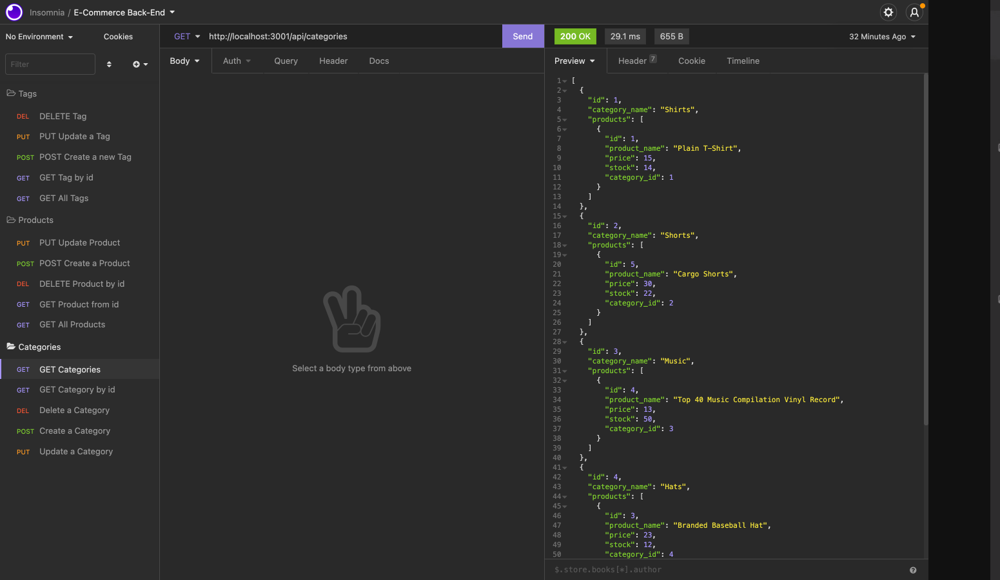

# e-commerce-back-end MIT 
  ## Description
  This project was motivated by learning how to connect a mysql database to a server ad manipulate the data. This project is able to configure Express.js API to use Sequelize to interact with the MySQL database. I learned how to manipulate a MySQL database using Sequelize.

  ## Table of Contents
  - [Installation](#installation)
  - [Usage](#usage)
  - [Credits](#credits)
  - [License](#license)
  
  ## Installation
  Create database in MySQL shell: SOURCE db/schema.sql; \
  Then run: npm run seed \
  And then run: npm node start

  ## Usage

  
  
  [Link to Video](https://drive.google.com/file/d/1Lq0hUUpFLQR3HXq8-fWSlQx3jzu9OHyt/view?usp=sharing)
  ## Credits
  Express.js, Sequelize, dotenv, MySql

  ## License
  

  Copyright 2022 Tina Stanczyk

  Permission is hereby granted, free of charge, to any person obtaining a copy of this software and associated documentation files (the "Software"), to deal in the Software without restriction, including without limitation the rights to use, copy, modify, merge, publish, distribute, sublicense, and/or sell copies of the Software, and to permit persons to whom the Software is furnished to do so, subject to the following conditions:
  
  The above copyright notice and this permission notice shall be included in all copies or substantial portions of the Software.
  
  THE SOFTWARE IS PROVIDED "AS IS", WITHOUT WARRANTY OF ANY KIND, EXPRESS OR IMPLIED, INCLUDING BUT NOT LIMITED TO THE WARRANTIES OF MERCHANTABILITY, FITNESS FOR A PARTICULAR PURPOSE AND NONINFRINGEMENT. IN NO EVENT SHALL THE AUTHORS OR COPYRIGHT HOLDERS BE LIABLE FOR ANY CLAIM, DAMAGES OR OTHER LIABILITY, WHETHER IN AN ACTION OF CONTRACT, TORT OR OTHERWISE, ARISING FROM, OUT OF OR IN CONNECTION WITH THE SOFTWARE OR THE USE OR OTHER DEALINGS IN THE SOFTWARE.
  
  

  https://opensource.org/licenses/MIT

  ## Badges
  Not Applicable

  ## Features
  Not Applicable

  ## How to Contribute
  Invest in my further development.

  ## Tests
  Not Applicable.

  ## Questions
  Contact me here if you have further questions: 

  Email - t9.stanczyk@gmail.com 

  Github - https://github.com/tinastanczyk 

